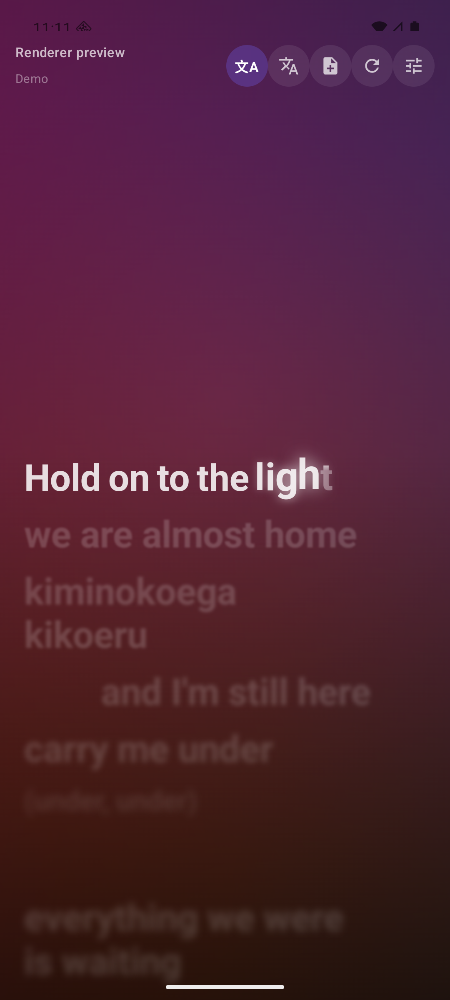
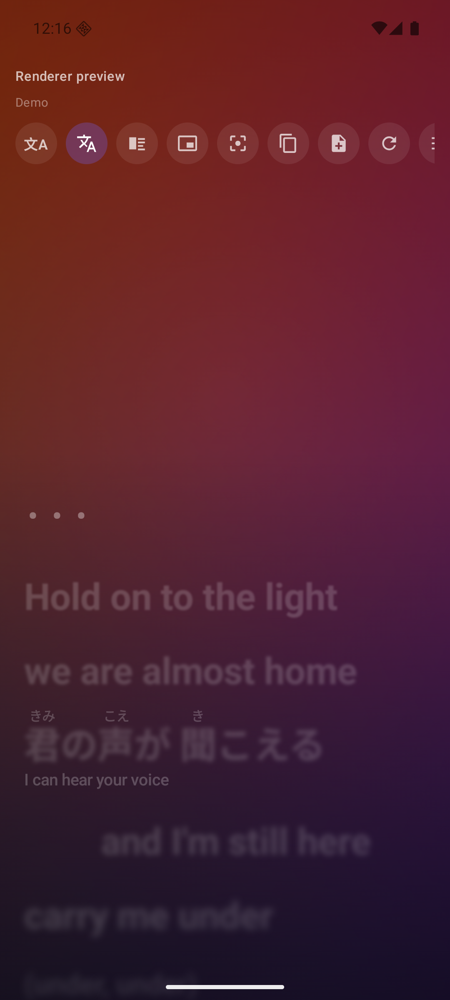
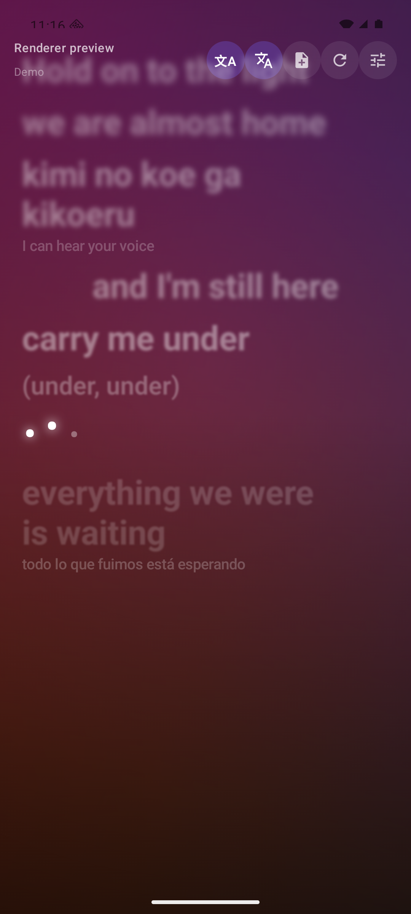
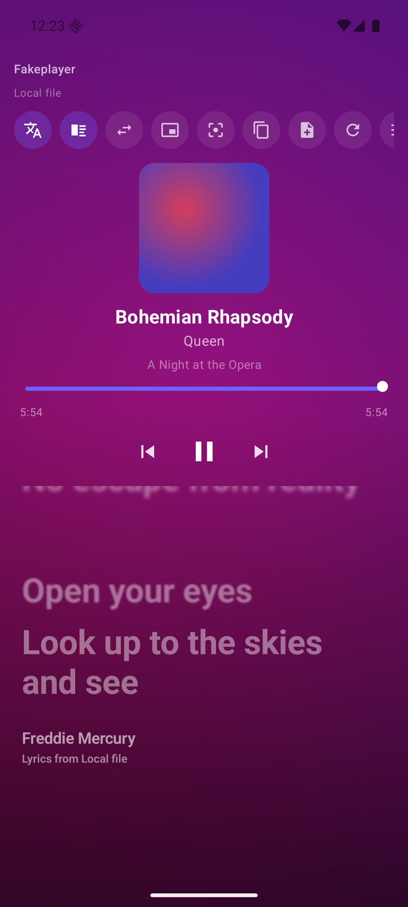
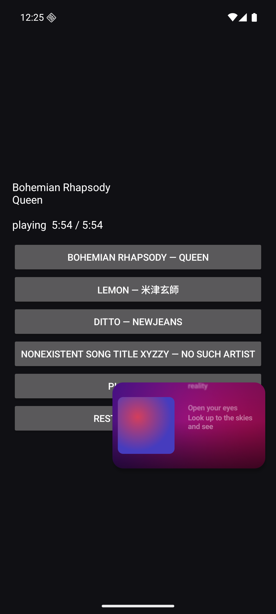
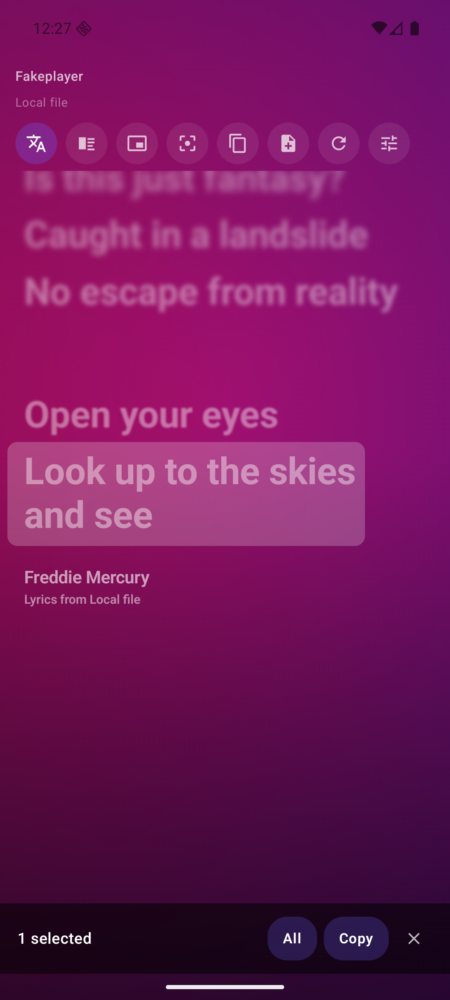
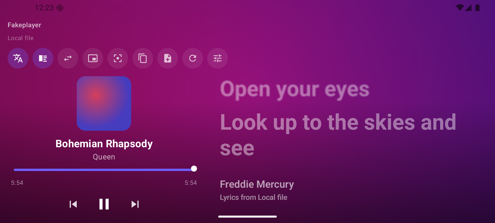

# Better Lyrics

A standalone Android app that shows word-by-word synced lyrics for whatever your phone
is playing — Spotify, YouTube Music, Apple Music, a local player, anything — with the
look and motion of [Spicy Lyrics](https://github.com/Spikerko/spicy-lyrics) from [Spicetify](https://github.com/spicetify/cli).

No Spotify login. No account of any kind.

> **Licence, up front:** this is a **port of Spicy Lyrics**, which is AGPL-3.0. So this is
> AGPL-3.0 too. See [LICENSE](LICENSE) and [NOTICE.md](NOTICE.md) — the second one is the
> honest accounting of what came from where.

| Active line, mid-word | Furigana over kanji | Instrumental gap |
|---|---|---|
|  |  |  |

| Cinema view | Popup lyrics | Copy lines |
|---|---|---|
|  |  |  |



## How it works

Android makes every media app publish a **media session**: the track, the artist, the
album, the duration, the artwork, and — the part that matters — a playhead with the
timestamp it was last reported at. Better Lyrics reads that session, extrapolates the
playhead from the wall clock between updates, looks the track up, and draws the words.

That is the whole trick, and it is why the app needs no integration with any particular
player. Reading other apps' sessions is gated behind Android's "notification access"
switch, so the app declares a `NotificationListenerService` that does nothing with
notifications — it exists purely to hold that permission.

```
Spotify (or anything)  ──►  MediaSession  ──►  MediaSessionRepository
                                                       │  track + playhead
                                                       ▼
                                              LyricsRepository
                                        (cache → providers in parallel)
                                                       │  timed words
                                                       ▼
                                romanize / furigana → translate → LyricsRenderer
```

## The rendering

A port of Spicy Lyrics' visual language, down to the curve constants:

- Each syllable is filled by a soft gradient that sweeps down through it as it is sung,
  while it lifts, swells past its resting size, and glows.
- A syllable held for over a second breaks into **individually animated letters**, so a
  held note ripples instead of sitting bright.
- Every other line is drawn as a **blur of itself**, with the radius growing the further
  it is from the current line. That is what gives the page its depth.
- Instrumental gaps of 3 seconds or more become **three dots** that breathe in turn.
- Duet lines pin to the opposite edge; backing vocals render smaller under their lead.
- Songwriters and the lyrics source close the song, inside the scroll rather than in the
  chrome.
- Scrolling is spring-driven and hands control back to you the moment you drag.
- The background is the album art reduced to a colour field and drifted past itself on
  long, non-repeating periods.

## Views

| | |
|---|---|
| **Lyrics** | Words fill the screen, with a now-playing bar underneath. |
| **Cinema** | Album art, title, artist, album, scrubber and transport beside the words — above them on a phone held upright, to the side when it is turned. A button swaps which side. |
| **Popup** | A floating window over other apps. Shrinks into it automatically when you leave, the way YouTube does, in **wide (16:9)**, **tall (9:16)** or **square**. The transport buttons on the window are the system's, driven by the app. |
| **Compact** | Tighter type and spacing, for split screen. |
| **Minimal** | Sung lines shrink and leave the page instead of dimming. |
| **Simple** | Flatter contrast, no letter-by-letter emphasis. |

Backgrounds: **Living** (the drifting colour field), **Auto** (still in the floating
window), **Cover art** with a blur slider, **Artist**, **Colour**, **Black**.

## Renewing the Spotify token

Spotify closed the endpoint that traded an `sp_dc` cookie for an access token, so the token has to
be copied out of the web player by hand — and it lasts about an hour, which makes it an errand
rather than a setting.

**Settings → Developer → Renew that token automatically** removes the errand. The only thing that
still mints a token is the player itself, and Android ships a Chromium to run it in: this loads
open.spotify.com in a WebView with your cookie and reads the token the player is given. Nothing is
drawn on screen, and the view is destroyed as soon as a token arrives. One launch an hour at most —
the token is cached until its own `exp` claim says otherwise.

That is a different thing from reproducing the signature the player signs its token request with.
Doing *that* would mean lifting a secret to defeat a check, and this app does not: see
`SpotifyWebToken.BLOCKED_BY_SPOTIFY`. Here the player signs its own request, as itself, with your
cookie, and the token that comes back is one your own browser would have received.

It is behind developer options, off by default, because it is still automated access to a service
whose terms discourage it. For one person on their own device that is a call they can make; it is
not something to ship switched on to everybody who installs a release.

## What a Spotify cookie adds

Beyond its own lyrics, the same `sp_dc`-derived token buys three things a media session
cannot give you — all behind one switch, *Use extras from Spotify*:

- **The artist's image**, which is what Spicy Lyrics' *Artist Header* background is.
- **The cover at full size** (640 px), instead of the 200–300 px thumbnail most players
  publish. The background, the palette and the Cinema view all improve.
- **The song's tempo**, which paces how fast the background drifts — a ballad no longer
  churns like a dance track.

Spicy Lyrics reads the true wide *header banner* through Spotify's internal GraphQL
gateway, which needs a persisted-query hash that changes with every web-player release.
This uses the documented endpoint and takes the artist image instead: the same artwork,
square rather than letterboxed, indistinguishable once blurred into a background, and it
does not break when Spotify ships an update.

## Language

**Romanization** turns non-Latin lyrics into something singable, per syllable, so the
karaoke fill still works:

- **Japanese** goes through Kuromoji, because kanji have no fixed reading — 生 is *ki*,
  *sei*, *nama* or *i* depending on the word. It also records where the word boundaries
  fall, so 君の声が becomes `kimi no koe ga` while 聞こえる stays `kikoeru`.
- **Chinese, Korean, Cyrillic and Greek** use the ICU transliterators built into Android.
- A romanization the provider already shipped is never overwritten.

**Furigana** prints the kana reading in small type over the kanji, the way a songbook
does — in **hiragana** or **katakana**. It comes out of the same dictionary lookup as the
romaji, and only shows while romanization is off, because it is a gloss *over* the
original text.

**Translation** runs on-device via ML Kit, so the lyrics never leave the phone. Each
language is a one-off ~30 MB model download, and nothing is fetched until you turn it on.
Provider-supplied translations take priority.

## Finding your way around

On first launch a **welcome guide** says plainly what is required (one permission), what
works with no setup at all, and what each optional token adds. It is in *Settings → About*
if you want it again.

Every setting carries a one-line description, and the **?** in the settings header expands
a longer explanation under each one — what it changes, and why you might want it.

## Copying

- **Hold** a line to copy it, with a highlight under your finger while you do.
- The **copy button** starts selection: tap lines to pick them out, then Copy — or All.
- **Copy all the lyrics** is in Settings, under *This track*.

## Where lyrics come from

Every enabled source is asked at once and the best answer wins — word-by-word beats
line-by-line beats unsynced. Order breaks ties.

| Provider | Timing | Needs |
|---|---|---|
| Your own files | up to word | `.lrc` / `.ttml` you import. Always wins. |
| Apple Music | **word** | A developer token and a music user token. Also brings official romanizations and translations. |
| Spotify | line | Your `sp_dc` cookie. The lyrics the Spotify app shows, matched to the exact track. |
| NetEase Cloud Music | **word** | Nothing. Also brings hand-checked romanization and translation — the best source for East Asian music. |
| Musixmatch | **word** | Nothing (a token of your own widens the catalogue). |
| LRCLIB | line | Nothing. Open community database. |

Every token, cookie and endpoint has a field in **Settings → Tokens and endpoints**,
including self-hosted LRCLIB and NetEase instances. A provider with nothing to
authenticate with is skipped rather than queried, and Settings says which one it is
waiting on.

Spikerko's own **Spicy Lyrics API** is deliberately *not* wired up: it would mean posting
someone's Spotify token to a third party and unpacking a bespoke binary payload, and it is
his service to run, not this app's to lean on.

## Building it

Needs the Android SDK (platform 36) and a JDK 17+.

```bash
./gradlew :app:assembleDebug          # debug APK
./gradlew :app:assembleRelease        # release APK (~51 MB)
./gradlew :app:testDebugUnitTest      # unit tests
```

With a `keystore.properties` present (see `keystore.properties.example`) the release APK
comes out **signed**; without one the same command still works and produces an unsigned
APK, so a fresh clone never needs anybody's key.

## Releases

Pushing a `v*` tag builds, signs and publishes an APK to GitHub Releases. The version name
comes from the tag; the version code from the run number.

```bash
git tag v0.2.0 && git push origin v0.2.0
```

Four repository secrets are needed once — **[docs/RELEASING.md](docs/RELEASING.md)** has the
commands, and the certificate fingerprint so you can check an APK is really yours.

## Setting it up on a phone

1. Install, open, and tap **Open notification access**; enable Better Lyrics in the list.
   Come back to the app — it picks the permission up on its own, retrying for a few
   seconds while the system binds the listener.
2. Play something. Lyrics appear.
3. Optional: paste any tokens you have into **Settings → Tokens and endpoints**.

The one control most people end up wanting is **Sync offset**. Players and audio routes
add their own latency — Bluetooth in particular can be a couple of hundred milliseconds
out — and this nudges every timestamp to compensate.

## Performance

The lyrics canvas is one draw node for the whole page, so playback costs **no
recomposition at all** — the frame loop only invalidates the draw phase. On top of that:

- The canvas is its own render node, so a per-frame lyric redraw does not drag the
  background into being re-rasterised with it. This was worth roughly **8×** in measured
  frame time.
- Non-active lines are drawn as one pass per wrapped row rather than one per syllable.
- The drifting background publishes at ~30 fps, not 60: its layers move on 30–70 second
  orbits, so the other half of the frames were redrawing three full-screen layers for a
  change nobody can see. A still background is cached as a layer and re-blitted.
- **Frames stop when nothing is moving.** Once a paused song has settled, the lyrics stop
  drawing entirely — measured at 55 frames per 8 s while playing against 8 while paused.

Absolute frame times were measured on a software-rendered emulator and are not meaningful
as such; the ratios above are.

## Looking at it while developing

Two affordances exist because the interesting half of this app needs a second app playing
music:

- **`:fakeplayer`** is a separate APK that publishes a real media session with a real
  advancing playhead, so detection, extrapolation and the transport controls can be
  exercised on an emulator with no music service installed.

  ```bash
  ./gradlew :fakeplayer:installDebug
  adb shell am start -n com.betterlyrics.fakeplayer/.FakePlayerActivity
  ```

  On an emulator, `adb shell settings put secure enabled_notification_listeners …` is not
  enough — the setting changes but the service is never bound. Use:

  ```bash
  adb shell cmd notification allow_listener \
      com.betterlyrics.app.debug/com.betterlyrics.app.media.MediaNotificationListener
  ```

- **Renderer preview** — in a debug build, the "nothing playing" screen offers a button
  that runs the renderer against a synthetic song on a looping clock. It covers the cases
  that are easy to get wrong: letter-level emphasis, Japanese with romanization and
  furigana, a duet line, a backing vocal, a translated line, and interludes at both ends.

To attach a lyrics file to a track without the file picker, drop it straight into the
app's store — the filename is the cache key:

```bash
adb shell "run-as com.betterlyrics.app.debug sh -c \
  'cat > /data/data/com.betterlyrics.app.debug/files/local-lyrics/bohemian_rhapsody-queen-177.lrc'" \
  < my.lrc
```

Also worth knowing:

- **The APK is large** (~51 MB release). Kuromoji's dictionary is 33 MB of it and ML Kit's
  translation engine most of the rest. Both are the price of correct Japanese readings and
  offline translation; both could become on-demand downloads later.
- **Only `arm64-v8a` and `x86_64`** are packaged, which covers every phone made in the
  last decade plus emulators.
- **Right-to-left lyrics** animate per word, not per syllable: splitting an Arabic or
  Hebrew run into syllables breaks the letter joins.
- **Musixmatch, Spotify and Apple Music** are undocumented endpoints. They are treated as
  optional throughout — a failure drops the provider, never the app.
- **Depth blur** relies on drawing text as transparent glyphs plus a shadow layer. If it
  renders oddly on some device, *Depth blur* in Settings turns it off.
- **Furigana on a syllable inside a longer word** takes a proportional slice of that
  word's reading. Approximate per syllable, but it never loses or repeats a sound.

## Credits

See **[NOTICE.md](NOTICE.md)**, and *Settings → Credits and licences* in the app itself.
The short version: this is [**Spicy Lyrics**](https://github.com/Spikerko/spicy-lyrics) by
Spikerko, read onto Android — its look, its animation curves, its lyric model and its TTML
dialect. The spring is a port of [Fraktality's `spr`](https://github.com/Fraktality/spr)
(MIT) and the curves of `cubic-spline` (MIT).
[**Beautiful Lyrics**](https://github.com/surfbryce/beautiful-lyrics) by surfbryce is prior
art and a reference point; no code from it is used.
